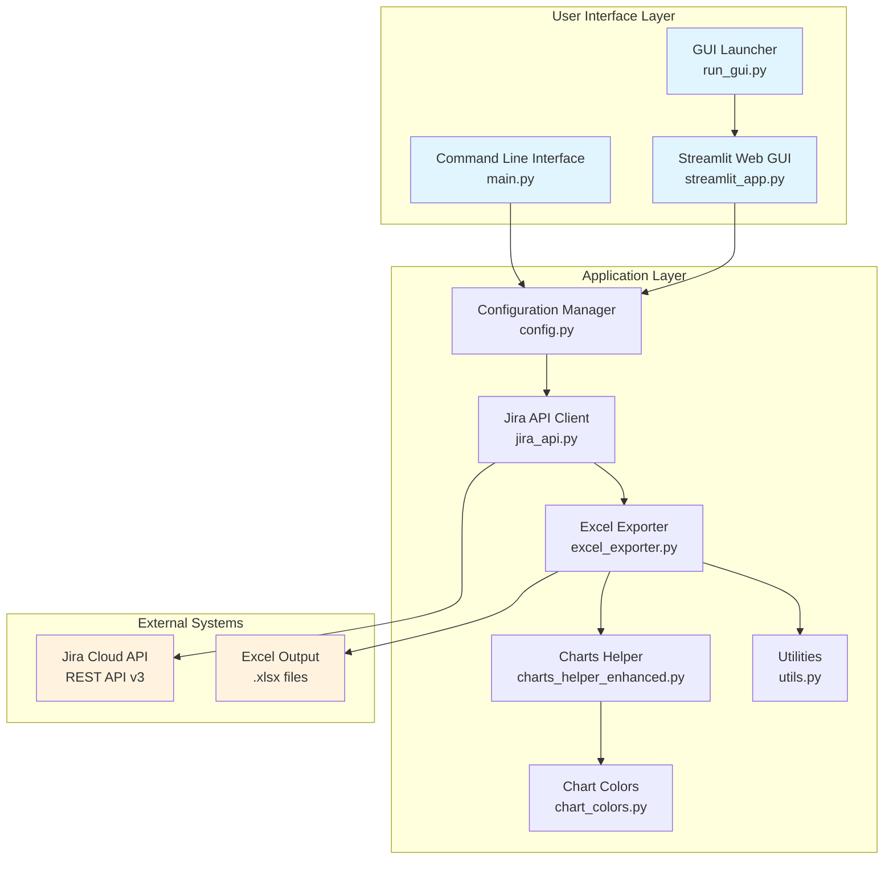
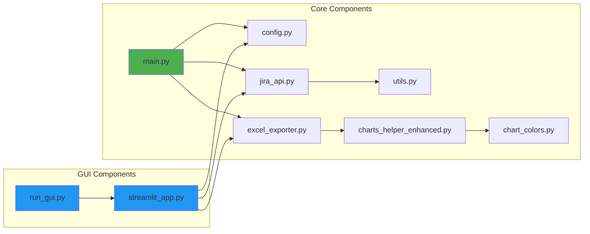
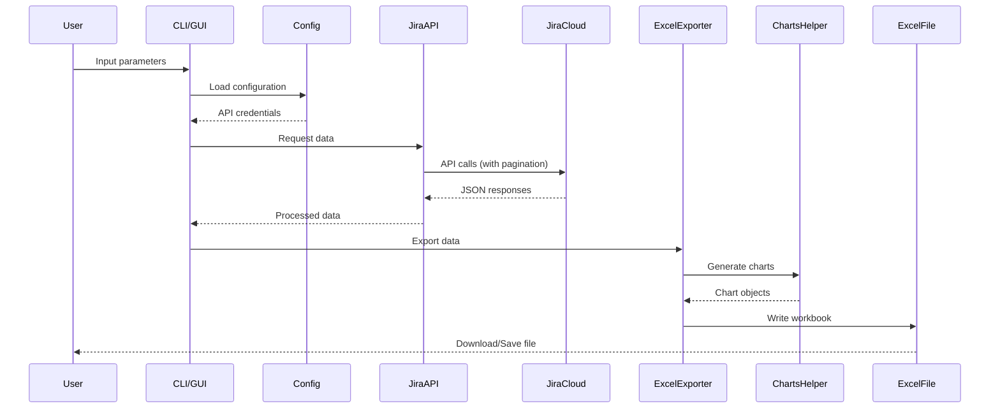
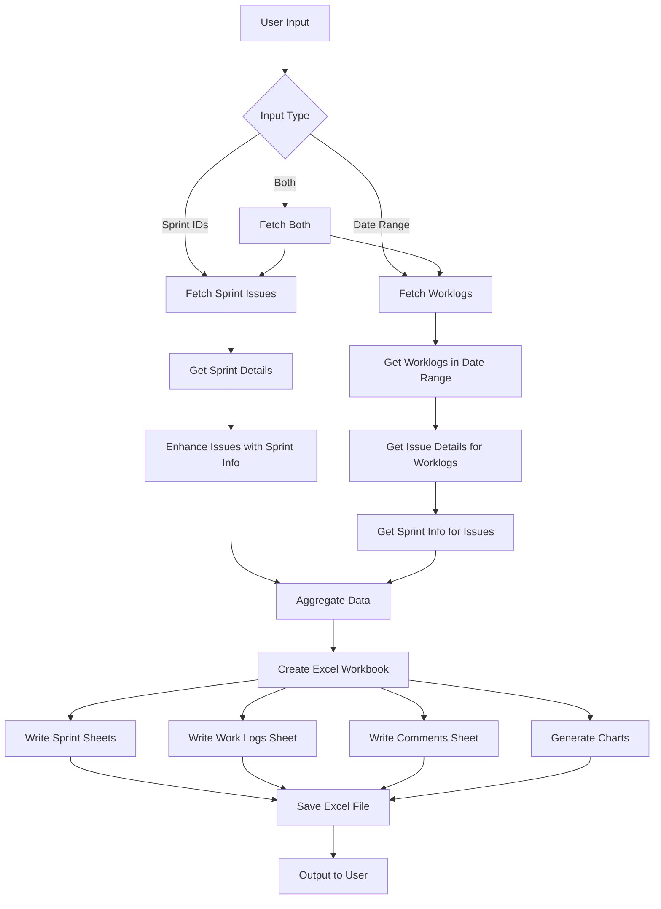
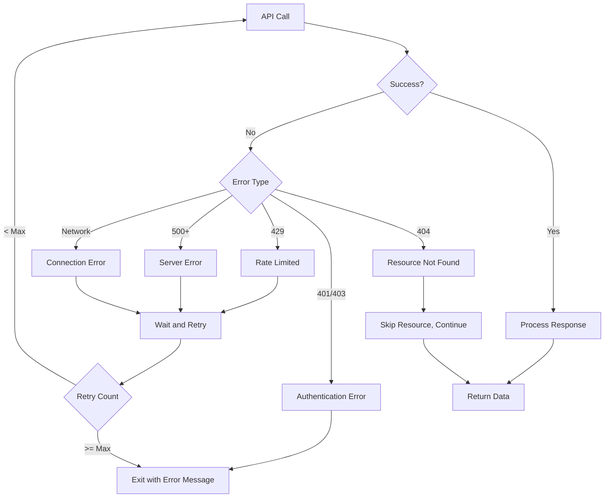

# Jira API Extractor - Architecture

## System Overview

The Jira API Extractor is a Python-based application that extracts data from Atlassian Jira using the REST API and exports it to Excel format with comprehensive analytics and visualizations.



## Component Architecture



## Data Flow



## Module Responsibilities

### User Interface Layer

#### `main.py`
- **Purpose**: Command-line interface entry point
- **Responsibilities**:
  - Parse command-line arguments
  - Validate input parameters
  - Orchestrate data extraction workflow
  - Handle errors and user feedback

#### `streamlit_app.py`
- **Purpose**: Web-based GUI using Streamlit
- **Responsibilities**:
  - Provide interactive web interface
  - Form-based parameter input
  - Real-time progress feedback
  - File download functionality
  - Auto-shutdown mechanism with heartbeat

#### `run_gui.py`
- **Purpose**: GUI launcher script
- **Responsibilities**:
  - Start Streamlit server
  - Open browser automatically
  - Handle process management

### Application Layer

#### `config.py`
- **Purpose**: Configuration management
- **Responsibilities**:
  - Load environment variables
  - Validate configuration
  - Provide configuration access to other modules
  - Manage API credentials securely

#### `jira_api.py`
- **Purpose**: Jira API client
- **Responsibilities**:
  - Authenticate with Jira Cloud
  - Fetch sprint issues
  - Fetch worklogs with date filtering
  - Fetch comments with date filtering
  - Handle pagination for large datasets
  - Parse sprint information
  - Error handling and retries

**Key Methods**:
- `get_issues_in_sprint(sprint_id)`: Fetch all issues in a sprint
- `get_sprint_details(sprint_id)`: Get sprint metadata
- `get_all_worklogs_in_date_range(project_key, start_date, end_date)`: Fetch worklogs
- `get_comments_in_date_range(project_key, start_date, end_date)`: Fetch comments
- `get_issue_sprints(issue_key)`: Get comprehensive sprint information

#### `excel_exporter.py`
- **Purpose**: Excel file generation
- **Responsibilities**:
  - Create Excel workbook structure
  - Write data to multiple sheets
  - Format headers and columns
  - Integrate charts
  - Apply styling
  - Save workbook to file

**Sheet Structure**:
- Sprint sheets (one per sprint)
- Work Logs sheet
- Comments sheet
- Charts sheet

#### `charts_helper_enhanced.py`
- **Purpose**: Chart generation for Excel
- **Responsibilities**:
  - Create pie charts (Issues by Status, Issues by Type, Time by Issue Type)
  - Create bar charts (Time by Author and Issue Type)
  - Create stacked bar charts (Time by Issue Type stacked by Sprint)
  - Generate sprint-specific charts
  - Apply color schemes
  - Position charts properly

**Chart Types**:
- Overall summary charts (4 charts)
- Per-sprint charts (3 charts per sprint)
- Stacked analysis charts

#### `utils.py`
- **Purpose**: Utility functions
- **Responsibilities**:
  - Parse Atlassian Document Format (ADF) to text
  - Handle pagination for API calls
  - Date/time formatting
  - Common helper functions

#### `chart_colors.py`
- **Purpose**: Chart color configuration
- **Responsibilities**:
  - Define color schemes for issue types
  - Define color schemes for issue statuses
  - Provide consistent colors across all charts
  - Default color fallbacks

## API Integration

### Jira Cloud REST API v3

**Endpoints Used**:
- `/rest/agile/1.0/sprint/{sprintId}/issue` - Fetch sprint issues
- `/rest/api/3/worklog/list` - Fetch worklogs (batch)
- `/rest/api/3/search/jql` - JQL search for comments and fallback queries
- `/rest/agile/1.0/sprint/{sprintId}` - Fetch sprint details
- `/rest/api/3/issue/{issueKey}` - Fetch issue details

**Authentication**: 
- Basic Auth with email + API token
- Token stored in `.env` file

**Rate Limiting**:
- Pagination with `maxResults` parameter
- Batch processing for efficiency
- Error handling for rate limit responses

## Data Processing Pipeline



## Configuration

### Environment Variables (`.env` or `JiraExtractor.env`)
```
JIRA_BASE_URL=https://your-domain.atlassian.net
JIRA_EMAIL=your-email@example.com
JIRA_API_TOKEN=your-api-token
```

### Command-Line Arguments
- `--project`: Jira project key (required)
- `--sprint`: Sprint ID(s), comma-separated for multiple
- `--start_date`: Start date for worklogs/comments (YYYY-MM-DD)
- `--end_date`: End date for worklogs/comments (YYYY-MM-DD)

## Error Handling Strategy



## Security Considerations

1. **API Token Storage**: Tokens stored in `.env` files (not committed to git)
2. **HTTPS Only**: All API calls use HTTPS
3. **No Hardcoded Credentials**: Configuration loaded from environment
4. **Input Validation**: All user inputs validated before processing
5. **Error Messages**: Sensitive information not exposed in error messages

## Performance Optimizations

1. **Pagination**: Handle large datasets efficiently
2. **Batch Processing**: Fetch worklogs in batches
3. **Caching**: Sprint details cached to avoid redundant API calls
4. **Efficient Queries**: Use specific JQL queries to minimize data transfer
5. **Parallel Processing**: Independent API calls can be parallelized

## Deployment Options

### Standalone CLI
```bash
python3 main.py --project PROJECT --sprint 123 --start_date 2025-01-01 --end_date 2025-01-31
```

### Web GUI
```bash
python3 run_gui.py
# or
streamlit run streamlit_app.py
```

### macOS App Bundle
- Packaged using PyInstaller
- Standalone .app bundle
- No Python installation required
- Distributed as `.zip` file

## Technology Stack

- **Language**: Python 3.x
- **Web Framework**: Streamlit
- **Excel Library**: openpyxl
- **HTTP Client**: requests
- **Environment Management**: python-dotenv
- **Packaging**: PyInstaller (for macOS app)

## Future Architecture Considerations

1. **Database Integration**: Store historical data for trend analysis
2. **Caching Layer**: Redis/Memcached for API response caching
3. **Background Jobs**: Celery for scheduled extractions
4. **Multi-tenancy**: Support multiple Jira instances
5. **REST API**: Expose functionality as REST API for integrations
6. **Docker**: Containerization for easier deployment
7. **Cloud Deployment**: AWS/GCP/Azure hosting options
