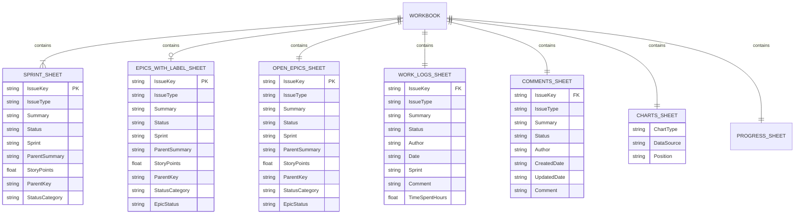
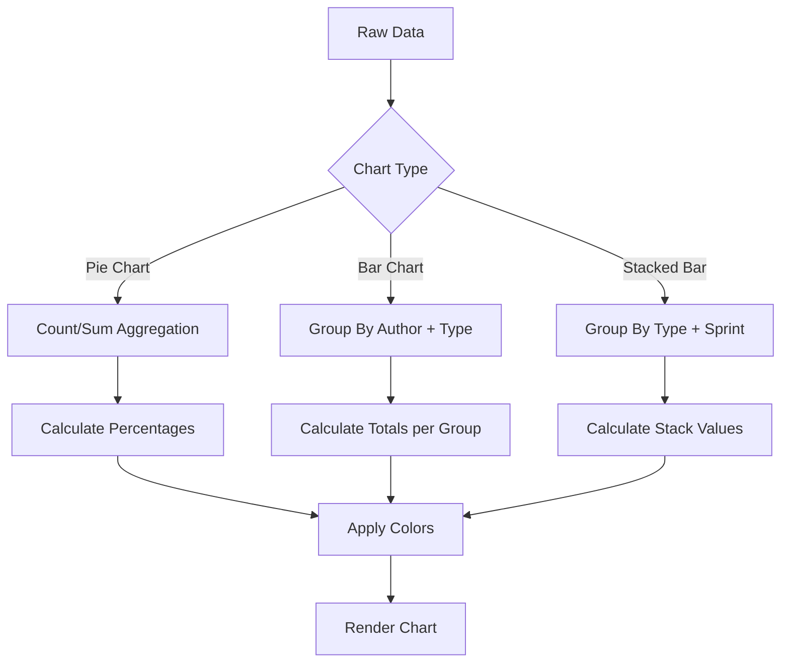
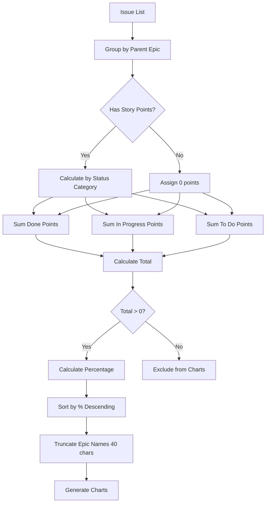
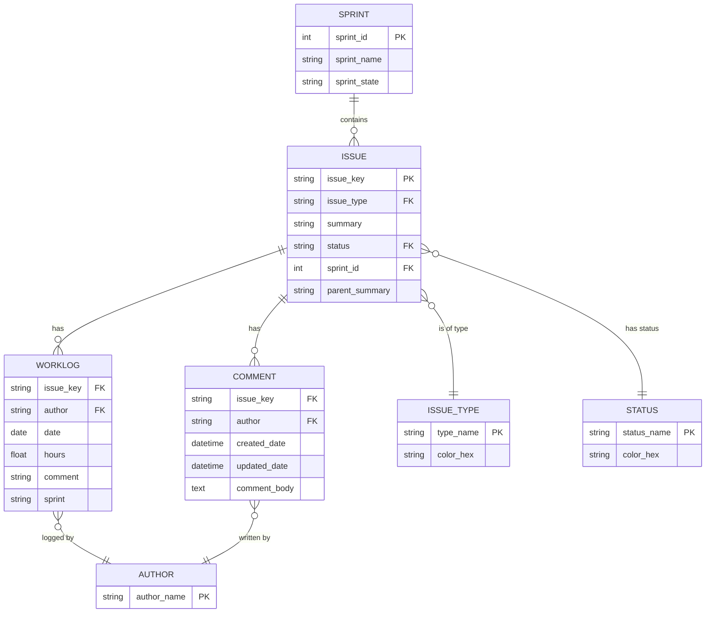
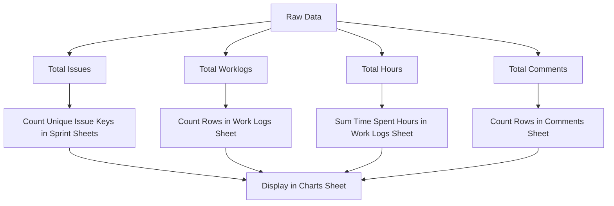
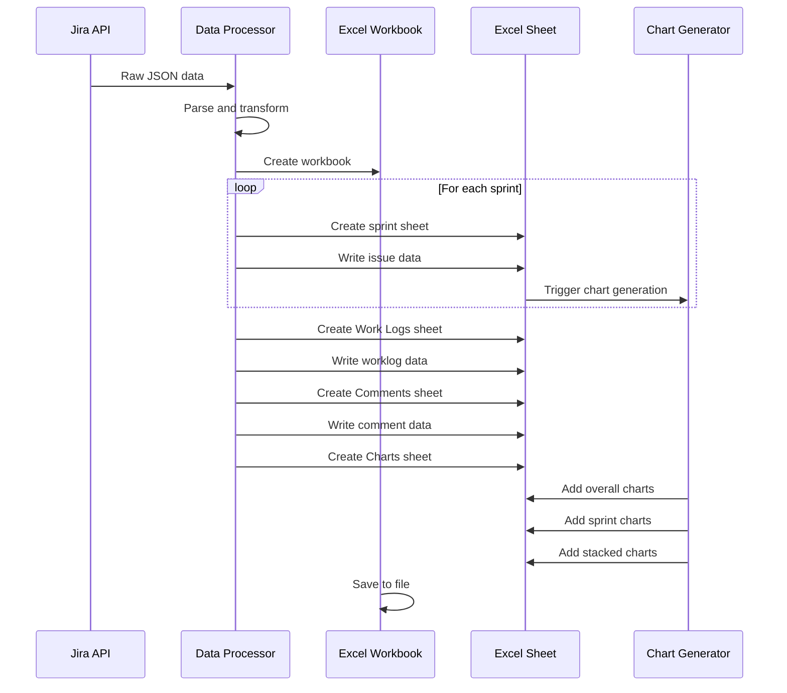
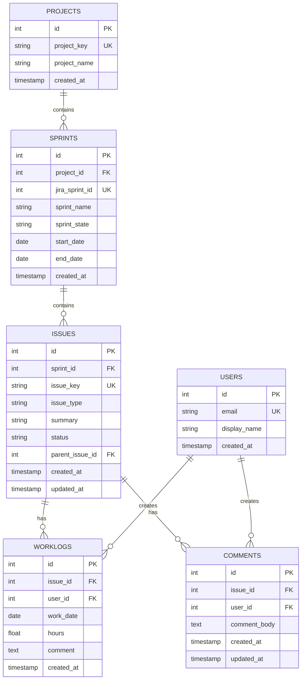

# Jira API Extractor - Data Structure

## Overview

The Jira API Extractor does not use a traditional database. Instead, it exports data directly to Excel workbooks with a structured schema. This document describes the Excel file structure and data organization.

## Excel Workbook Structure



## Sheet Schemas

### Sprint Sheets (One per Sprint)

**Sheet Name Format**: `Sprint {sprint_id}` or `{sprint_name}`

**Purpose**: Contains all issues within a specific sprint

**Columns**:

| Column | Type | Description | Example |
|--------|------|-------------|---------|
| Issue Key | String | Unique Jira issue identifier | NG-951 |
| Issue Type | String | Type of issue | Story, Bug, Refinement, Ad-Hoc, Support, Emergency |
| Summary | String | Issue title/summary | Implement user authentication |
| Status | String | Current issue status | To Do, In Progress, DONE, Ready for Prod |
| Sprint | String | Sprint name | Cycle 2, Ref.Cycle 1 |
| Parent Summary | String | Parent issue summary (if exists) | Epic: User Management |
| **Story Points** | Float | **Story point estimate** | **5.0, 8.0, 0** |
| **Parent Key** | String | **Parent issue key** | **NG-100, N/A** |
| **Status Category** | String | **High-level status category** | **To Do, In Progress, Done** |

**Indexes**:
- Primary Key: Issue Key (unique)
- Foreign Key: Sprint (references sprint metadata)
- Foreign Key: Parent Key (references parent issue)

**Sample Data**:
```
Issue Key | Issue Type | Summary                    | Status      | Sprint      | Parent Summary    | Story Points | Parent Key | Status Category
----------|------------|----------------------------|-------------|-------------|-------------------|--------------|------------|----------------
NG-951    | Refinement | API endpoint design        | DONE        | Next in line| Epic: API Layer   | 3.0          | NG-100     | Done
NG-961    | Story      | User login functionality   | In Progress | Cycle 2     | Epic: Auth        | 8.0          | NG-200     | In Progress
NG-956    | Bug        | Fix validation error       | DONE        | Ref.Cycle 1 | N/A               | 0            | N/A        | Done
```

**New Fields (P-001)**:
- **Story Points**: Configurable custom field (default: `customfield_10016`), displays `0` if not set
- **Parent Key**: Direct reference to parent issue, useful for epic tracking
- **Status Category**: Jira's built-in categorization (To Do, In Progress, Done)

### Work Logs Sheet

**Sheet Name**: `Work Logs`

**Purpose**: Contains all work log entries within the specified date range

**Columns**:

| Column | Type | Description | Example |
|--------|------|-------------|---------|
| Issue Key | String | Jira issue identifier (FK) | NG-951 |
| Issue Type | String | Type of issue | Story |
| Summary | String | Issue summary | Implement user authentication |
| Status | String | Issue status at time of worklog | In Progress |
| Author | String | Person who logged the work | John Doe |
| Date | Date | Date work was performed (YYYY-MM-DD) | 2025-07-15 |
| Sprint | String | Sprint name | Cycle 2 |
| Comment | String | Worklog comment/description | Implemented login endpoint |
| Time Spent Hours | Float | Hours logged | 4.5 |

**Indexes**:
- Foreign Key: Issue Key (references Sprint Sheets)
- Index: Author (for grouping)
- Index: Date (for filtering)
- Index: Sprint (for grouping)

**Data Validation**:
- Date: Must be within specified date range
- Time Spent Hours: Must be positive number
- Issue Key: Must exist in Jira

**Sample Data**:
```
Issue Key | Issue Type | Summary           | Status      | Author    | Date       | Sprint  | Comment              | Time Spent Hours
----------|------------|-------------------|-------------|-----------|------------|---------|----------------------|-----------------
NG-961    | Story      | User login        | In Progress | John Doe  | 2025-07-15 | Cycle 2 | Implemented endpoint | 4.5
NG-961    | Story      | User login        | In Progress | Jane Smith| 2025-07-16 | Cycle 2 | Added validation     | 3.0
NG-956    | Bug        | Fix validation    | DONE        | John Doe  | 2025-07-14 | Cycle 1 | Fixed regex pattern  | 2.0
```

### Comments Sheet

**Sheet Name**: `Comments`

**Purpose**: Contains all comments on issues within the specified date range

**Columns**:

| Column | Type | Description | Example |
|--------|------|-------------|---------|
| Issue Key | String | Jira issue identifier (FK) | NG-951 |
| Issue Type | String | Type of issue | Story |
| Summary | String | Issue summary | Implement user authentication |
| Status | String | Current issue status | In Progress |
| Author | String | Comment author | John Doe |
| Created Date | DateTime | When comment was created | 2025-07-15 10:30:00 |
| Updated Date | DateTime | When comment was last updated | 2025-07-15 14:20:00 |
| Comment | Text | Comment body (parsed from ADF) | This needs to be reviewed by security team |

**Indexes**:
- Foreign Key: Issue Key (references Sprint Sheets)
- Index: Author (for grouping)
- Index: Created Date (for filtering)

**Data Processing**:
- Comment text parsed from Atlassian Document Format (ADF) to plain text
- Preserves line breaks and basic formatting
- Removes rich formatting (bold, italic, etc.)

**Sample Data**:
```
Issue Key | Issue Type | Summary      | Status      | Author    | Created Date        | Updated Date        | Comment
----------|------------|--------------|-------------|-----------|---------------------|---------------------|------------------
NG-961    | Story      | User login   | In Progress | John Doe  | 2025-07-15 10:30:00 | 2025-07-15 10:30:00 | Ready for review
NG-961    | Story      | User login   | In Progress | Jane Smith| 2025-07-16 09:15:00 | 2025-07-16 11:20:00 | Looks good, approved
NG-956    | Bug        | Fix validation| DONE       | John Doe  | 2025-07-14 16:45:00 | 2025-07-14 16:45:00 | Fixed and tested
```

### Epics with Label Sheet (NEW - P-001)

**Sheet Name**: `Epics with Label`

**Purpose**: Contains all issues from epics that match a specific label filter (conditional - only created when `--epic_label` parameter provided)

**Columns**:

| Column | Type | Description | Example |
|--------|------|-------------|---------|
| Issue Key | String | Unique Jira issue identifier | NG-951 |
| Issue Type | String | Type of issue | Story, Bug, Refinement |
| Summary | String | Issue title/summary | Implement user authentication |
| Status | String | Current issue status | To Do, In Progress, DONE |
| Sprint | String | Sprint name (if assigned) | Cycle 2, (empty) |
| Parent Summary | String | Parent epic summary | Epic: Q1 Features |
| Story Points | Float | Story point estimate | 5.0, 0 |
| Parent Key | String | Parent epic key | NG-100 |
| Status Category | String | High-level status category | To Do, In Progress, Done |
| **Epic Status** | String | **Status of the parent epic** | **In Progress, DONE** |

**Indexes**:
- Primary Key: Issue Key (unique)
- Foreign Key: Parent Key (references epic)
- Index: Epic Status (for filtering)

**Sample Data**:
```
Issue Key | Issue Type | Summary              | Status      | Sprint  | Parent Summary    | Story Points | Parent Key | Status Category | Epic Status
----------|------------|----------------------|-------------|---------|-------------------|--------------|------------|-----------------|-------------
NG-951    | Story      | User authentication  | In Progress | Cycle 2 | Epic: Q1 Features | 8.0          | NG-100     | In Progress     | In Progress
NG-952    | Story      | Password reset       | To Do       |         | Epic: Q1 Features | 5.0          | NG-100     | To Do           | In Progress
NG-953    | Bug        | Fix login timeout    | DONE        | Cycle 1 | Epic: Q1 Features | 3.0          | NG-100     | Done            | In Progress
```

**Usage**:
```bash
# Filter epics by label
python3 main.py --project NG --epic_label "Q1-2025"
```

**Notes**:
- Sheet only created when `--epic_label` parameter is provided
- Ignores date range filters - exports all issues from matching epics
- Epic status shows the current status of the parent epic
- Useful for tracking all work related to specific initiatives or quarters

### Open Epics Sheet (NEW - P-001)

**Sheet Name**: `Open Epics`

**Purpose**: Contains all issues from epics that are not in "Done" status category (always created)

**Columns**:

| Column | Type | Description | Example |
|--------|------|-------------|---------|
| Issue Key | String | Unique Jira issue identifier | NG-961 |
| Issue Type | String | Type of issue | Story, Bug, Refinement |
| Summary | String | Issue title/summary | Implement dashboard |
| Status | String | Current issue status | In Progress, To Do |
| Sprint | String | Sprint name (if assigned) | Cycle 2, (empty) |
| Parent Summary | String | Parent epic summary | Epic: Dashboard |
| Story Points | Float | Story point estimate | 8.0, 0 |
| Parent Key | String | Parent epic key | NG-200 |
| Status Category | String | High-level status category | To Do, In Progress |
| **Epic Status** | String | **Status of the parent epic** | **In Progress, To Do** |

**Indexes**:
- Primary Key: Issue Key (unique)
- Foreign Key: Parent Key (references epic)
- Index: Epic Status (for filtering)
- Index: Status Category (for filtering)

**Sample Data**:
```
Issue Key | Issue Type | Summary              | Status      | Sprint  | Parent Summary  | Story Points | Parent Key | Status Category | Epic Status
----------|------------|----------------------|-------------|---------|-----------------|--------------|------------|-----------------|-------------
NG-961    | Story      | Dashboard widgets    | In Progress | Cycle 2 | Epic: Dashboard | 8.0          | NG-200     | In Progress     | In Progress
NG-962    | Story      | Chart components     | To Do       |         | Epic: Dashboard | 5.0          | NG-200     | To Do           | In Progress
NG-963    | Bug        | Fix data loading     | In Progress | Cycle 2 | Epic: Dashboard | 3.0          | NG-200     | In Progress     | In Progress
```

**Usage**:
```bash
# Always included in export
python3 main.py --project NG --sprint 528
```

**Notes**:
- Always created (not conditional)
- Uses JQL: `type=Epic AND statusCategory!=Done` to find open epics
- Provides visibility into all current work across the project
- Useful for understanding current commitments and prioritizing work
- Epic status will be "In Progress", "To Do", or any non-Done status

### Charts Sheet

**Sheet Name**: `Charts`

**Purpose**: Contains all analytical charts and visualizations

**Chart Types and Data Sources**:

#### 1. Overall Summary Charts

| Chart Name | Type | Data Source | Position | Description |
|------------|------|-------------|----------|-------------|
| Issues by Status | Pie | Sprint Sheets | D2 | Distribution of issues by status |
| Issues by Type | Pie | Sprint Sheets | D15 | Distribution of issues by type |
| Total Time by Issue Type | Pie | Work Logs Sheet | D28 | Total hours by issue type |
| Time by Author and Issue Type | Bar | Work Logs Sheet | D41 | Multi-series bar chart |

#### 2. Sprint-Specific Charts (Per Sprint)

| Chart Name | Type | Data Source | Position | Description |
|------------|------|-------------|----------|-------------|
| {Sprint Name} - Issues by Status | Pie | Sprint Sheet | P{row} | Status distribution per sprint |
| {Sprint Name} - Issues by Type | Pie | Sprint Sheet | AB{row} | Type distribution per sprint |
| {Sprint Name} - Time by Issue Type | Pie | Work Logs Sheet | AT{row} | Time distribution per sprint |

#### 3. Cross-Sprint Analysis Charts

| Chart Name | Type | Data Source | Position | Description |
|------------|------|-------------|----------|-------------|
| Time by Issue Type (Stacked by Sprint) | Stacked Bar | Work Logs Sheet | D54 | Stacked comparison across sprints |

**Chart Data Calculation**:



### Progress Sheet

**Sheet Name**: `Progress`

**Purpose**: Contains progress visualization charts showing epic completion by percentage and story points

**Chart Types and Data Sources**:

#### 1. Sprint Progress Charts (3 charts per sprint)

| Chart Name | Type | Data Source | Position | Description |
|------------|------|-------------|----------|-------------|
| {Sprint Name} - Progress by Epic (%) | Horizontal Bar | Sprint Sheet | A{row} | Completion percentage per epic |
| {Sprint Name} - Progress by Epic (Story Points) | Stacked Bar | Sprint Sheet | Q{row} | Story points breakdown (Done/In Progress/To Do) |
| {Sprint Name} - Composition by Epic | Pie | Sprint Sheet | AG{row} | Epic distribution by total story points |

#### 2. Epic Label Progress Charts (2 charts, conditional)

| Chart Name | Type | Data Source | Position | Description |
|------------|------|-------------|----------|-------------|
| Epic Label Progress by Epic (%) | Horizontal Bar | Epics with Label Sheet | A{row} | Completion percentage for labeled epics |
| Epic Label Progress by Epic (Story Points) | Stacked Bar | Epics with Label Sheet | Q{row} | Story points breakdown for labeled epics |

**Note**: These charts are only created when `--epic_label` parameter is provided.

#### 3. Open Epic Progress Charts (2 charts, always included)

| Chart Name | Type | Data Source | Position | Description |
|------------|------|-------------|----------|-------------|
| Open Epics Progress by Epic (%) | Horizontal Bar | Open Epics Sheet | A{row} | Completion percentage for all open epics |
| Open Epics Progress by Epic (Story Points) | Stacked Bar | Open Epics Sheet | Q{row} | Story points breakdown for all open epics |

**Data Aggregation Logic**:



**Chart Features**:
- **Sorting**: Epics sorted by completion percentage (highest first)
- **Filtering**: Excludes epics with 0 total story points
- **Naming**: Epic names truncated to 40 characters + "..."
- **Grouping**: Issues without parent grouped as "No Epic"
- **Colors**: Done (green #4CAF50), In Progress (yellow #FFC107), To Do (blue #2196F3)
- **Stacked Order**: Done (left) → In Progress (middle) → To Do (right)

**Data Columns** (used for chart generation):

| Column | Type | Description | Example |
|--------|------|-------------|---------|
| Epic | String | Epic name (truncated) | Goal Highlights with Segment NBA |
| Completion % | Float | Percentage of done story points | 92.3 |
| Done | Float | Story points in Done status | 24 |
| In Progress | Float | Story points in In Progress status | 0 |
| To Do | Float | Story points in To Do status | 2 |
| Story Points | Float | Total story points for epic | 26 |

**Sample Data**:
```
Epic                                    | Completion % | Done | In Progress | To Do | Total
----------------------------------------|--------------|------|-------------|-------|------
Goal Highlights with Segment NBA        | 92.3         | 24   | 0           | 2     | 26
Funnel Report                           | 90.0         | 27   | 3           | 0     | 30
(TBD) YouTube Live Comments             | 64.0         | 16   | 9           | 0     | 25
Propensity Model Report                 | 13.0         | 3    | 0           | 20    | 23
```

## Data Relationships



## Data Types and Constraints

### Field Specifications

| Field Name | Data Type | Max Length | Nullable | Default | Constraints |
|------------|-----------|------------|----------|---------|-------------|
| Issue Key | String | 50 | No | - | Format: PROJECT-NUMBER |
| Issue Type | String | 50 | No | - | Enum: Story, Bug, Refinement, Ad-Hoc, Support, Emergency |
| Summary | String | 500 | No | - | - |
| Status | String | 50 | No | - | - |
| Sprint | String | 200 | Yes | "" (empty) | Comma-separated for multiple sprints |
| Parent Summary | String | 500 | Yes | N/A | - |
| **Story Points** | Float | - | Yes | 0 | Must be >= 0 if set |
| **Parent Key** | String | 50 | Yes | N/A | Format: PROJECT-NUMBER |
| **Status Category** | String | 20 | No | - | Enum: To Do, In Progress, Done |
| **Epic Status** | String | 50 | Yes | N/A | Only in epic sheets |
| Author | String | 100 | No | - | - |
| Date | Date | - | No | - | Format: YYYY-MM-DD |
| Created Date | DateTime | - | No | - | Format: YYYY-MM-DD HH:MM:SS |
| Updated Date | DateTime | - | No | - | Format: YYYY-MM-DD HH:MM:SS |
| Comment | Text | 10000 | Yes | - | - |
| Time Spent Hours | Float | - | No | - | Must be > 0 |

## Data Aggregations

### Summary Statistics

The Charts sheet includes calculated summary statistics:



**Formulas Used**:
- Total Issues: `=COUNTA('Sprint Issues'!A:A)-1`
- Total Worklogs: `=COUNTA('Work Logs'!A:A)-1`
- Total Hours: `=SUM('Work Logs'!I:I)`
- Total Comments: `=COUNTA('Comments'!A:A)-1`

### Chart Data Aggregations

#### Issues by Status
```
Status      | Count | Formula
------------|-------|----------------------------------
To Do       | 5     | =COUNTIF('Sprint Issues'!D:D,"To Do")
In Progress | 3     | =COUNTIF('Sprint Issues'!D:D,"In Progress")
DONE        | 12    | =COUNTIF('Sprint Issues'!D:D,"DONE")
```

#### Time by Author and Issue Type
```
Author     | Story | Bug | Refinement | Total
-----------|-------|-----|------------|-------
John Doe   | 15.5  | 4.0 | 8.0        | 27.5
Jane Smith | 12.0  | 6.5 | 5.0        | 23.5
```

Formula: `=SUMIFS('Work Logs'!I:I,'Work Logs'!E:E,Author,'Work Logs'!B:B,IssueType)`

## Color Schemes

### Issue Type Colors

| Issue Type | Hex Color | RGB | Visual |
|------------|-----------|-----|--------|
| Story | #4CAF50 | 76, 175, 80 | 🟢 Green |
| Bug | #F44336 | 244, 67, 54 | 🔴 Red |
| Refinement | #2196F3 | 33, 150, 243 | 🔵 Blue |
| Ad-Hoc | #FF9800 | 255, 152, 0 | 🟠 Orange |
| Support | #9C27B0 | 156, 39, 176 | 🟣 Purple |
| Emergency | #D32F2F | 211, 47, 47 | 🔴 Bright Red |

### Status Colors

| Status | Hex Color | RGB | Visual |
|--------|-----------|-----|--------|
| To Do | #90CAF9 | 144, 202, 249 | 🔵 Light Blue |
| In Progress | #FFF176 | 255, 241, 118 | 🟡 Yellow |
| DONE | #388E3C | 56, 142, 60 | 🟢 Dark Green |
| Ready for Prod | #1976D2 | 25, 118, 210 | 🔵 Blue |
| Blocked | #E57373 | 229, 115, 115 | 🔴 Light Red |

## Data Export Process



## Data Quality and Validation

### Input Validation
- Date formats validated before API calls
- Sprint IDs validated for existence
- Project keys validated against Jira instance

### Data Integrity
- Issue keys verified to exist in Jira
- Sprint references validated
- Author names preserved as-is from Jira
- Timestamps preserved in original timezone

### Error Handling
- Missing data: Displayed as "N/A"
- Invalid dates: Skipped with warning
- API errors: Logged and reported to user
- Empty results: Generate empty sheets with headers

## Performance Considerations

### Data Volume Limits
- **Issues per Sprint**: No limit (pagination handled)
- **Worklogs**: No limit (pagination handled)
- **Comments**: No limit (pagination handled)
- **Excel File Size**: Typically < 5 MB for 1000 issues

### Optimization Strategies
1. **Batch Processing**: Fetch worklogs in batches of 1000
2. **Caching**: Sprint details cached to avoid redundant API calls
3. **Efficient Queries**: Use JQL to filter data at source
4. **Static Charts**: Use static data instead of formulas for better performance

## Future Enhancements

### Potential Database Integration

If moving to a traditional database (e.g., PostgreSQL):



### Indexes for Performance
```sql
-- Issues
CREATE INDEX idx_issues_sprint_id ON issues(sprint_id);
CREATE INDEX idx_issues_status ON issues(status);
CREATE INDEX idx_issues_type ON issues(issue_type);

-- Worklogs
CREATE INDEX idx_worklogs_issue_id ON worklogs(issue_id);
CREATE INDEX idx_worklogs_user_id ON worklogs(user_id);
CREATE INDEX idx_worklogs_date ON worklogs(work_date);

-- Comments
CREATE INDEX idx_comments_issue_id ON comments(issue_id);
CREATE INDEX idx_comments_user_id ON comments(user_id);
CREATE INDEX idx_comments_created ON comments(created_at);
```

## Appendix: Sample Excel Structure

### File: `JiraExport_NG_2025-07-11_to_2025-07-18.xlsx`

**Sheets**:
1. Sprint 528 (Ref.Cycle 1) - 5 issues
2. Sprint 560 (Cycle 2) - 3 issues
3. Work Logs - 14 entries
4. Comments - 15 entries
5. Charts - 11 charts

**File Size**: ~18 KB

**Compatibility**: Excel 2010+, LibreOffice Calc, Google Sheets
